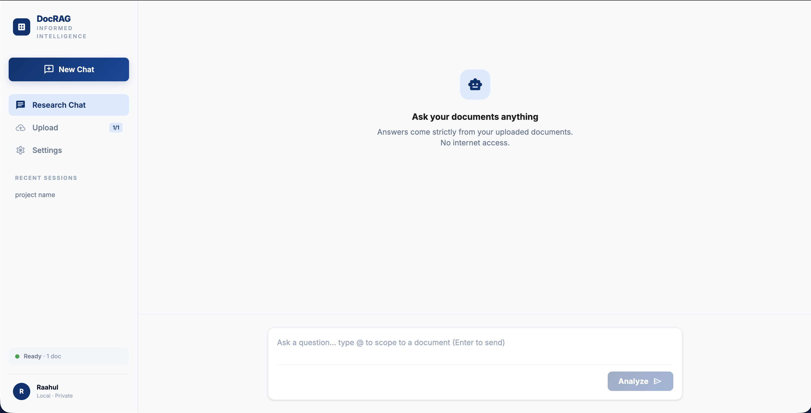
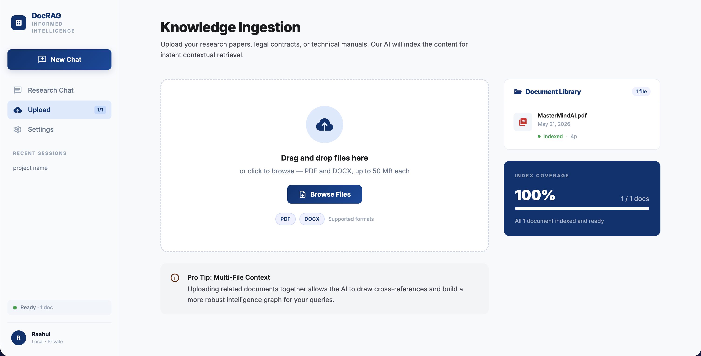
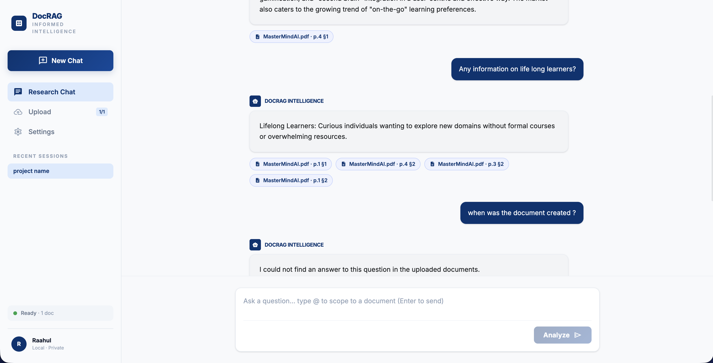
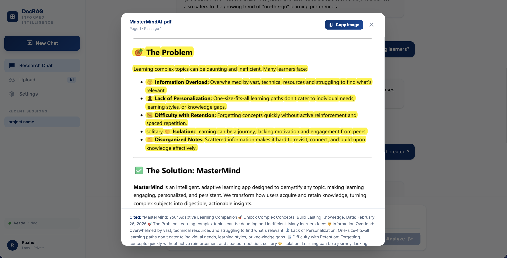

# Document RAG

A locally hosted Retrieval-Augmented Generation (RAG) system for querying PDF and DOCX documents using hybrid search, cross-encoder reranking, and streaming LLM responses. Everything runs in a single Docker container — no external services required beyond a Gemini API key.

---

## Screenshots

**Home — empty state**


**Knowledge Ingestion — document library**


**Chat — streaming answers with source citations**


**Snippet Viewer — exact passage highlight**


---

## Architecture Overview

```
Upload (PDF/DOCX)
       │
       ▼
┌─────────────────────────────────────────┐
│              Ingestion Pipeline          │
│  Parse → Chunk → Embed → Store          │
└────────────┬──────────────┬─────────────┘
             │              │
             ▼              ▼
       ChromaDB          SQLite
    (vector store)    (chunk metadata
                       + sessions)
             │              │
             └──────┬───────┘
                    │
             ┌──────▼───────┐
             │  BM25 Index  │ (in-memory, rebuilt on startup)
             └──────┬───────┘
                    │
             User Query
                    │
                    ▼
        ┌───────────────────────┐
        │  Hybrid Retrieval     │
        │  Vector (top 15)      │
        │  + BM25 (top 15)      │
        │  → Merge & Dedupe     │
        └───────────┬───────────┘
                    │
                    ▼
        ┌───────────────────────┐
        │  Cross-Encoder        │
        │  Reranking            │
        │  ms-marco-MiniLM-L-6  │
        └───────────┬───────────┘
                    │
                    ▼
        ┌───────────────────────┐
        │  Gemini 2.5 Flash     │
        │  (streaming / JSON)   │
        └───────────────────────┘
```

---

## Retrieval Pipeline

### 1. Document Ingestion

**Supported formats:** PDF (via PyMuPDF), DOCX (via python-docx)

**PDF parsing** uses PyMuPDF's block-level extraction with font metadata. Spans with font size ≥ 13pt, length < 200 characters, and no trailing period are classified as section headings. This preserves document structure without relying on heuristics like bold detection.

**DOCX parsing** reads paragraph styles directly. Paragraphs with a style name containing `heading` or `title` are treated as section boundaries.

**Deduplication:** Files are SHA-256 hashed at upload time. Re-uploading an identical file returns HTTP 409.

---

### 2. Chunking Strategy

| Parameter | Value |
|-----------|-------|
| Max chunk size | 1,500 characters |
| Overlap | 250 characters (~17%) |
| Min section size | 150 characters (merged upward if smaller) |

Chunking is **section-aware**: the parser first segments the document into headed sections, then splits oversized sections at word boundaries with the configured overlap. This avoids breaking sentences mid-word and keeps semantically related content together.

Each chunk is assigned a `passage_index` within its page, which the frontend uses to render precise in-document highlights via the snippet viewer.

**Why not semantic chunking?** Semantic chunking (LLM-in-the-loop boundary detection) is expensive and non-deterministic. Fixed-overlap chunking with section awareness provides consistent, reproducible indexing at negligible cost.

---

### 3. Embedding Model — `nomic-ai/nomic-embed-text-v1.5`

| Property | Value |
|----------|-------|
| Dimensions | 768 |
| Parameters | ~137M |
| Provider | Hugging Face (sentence-transformers) |
| Runs locally | Yes — CPU/GPU |

Nomic Embed v1.5 uses **instruction prefixes** to distinguish indexing from retrieval:

```
Indexing:  "search_document: {chunk_text}"
Query:     "search_query: {query_text}"
```

All embeddings are L2-normalised before storage, making dot product equivalent to cosine similarity.

**Why Nomic Embed v1.5?** It achieves near-parity with OpenAI `text-embedding-3-large` on the MTEB benchmark at 768 dimensions while being fully open-source and running locally. The instruction-prefix design avoids the performance degradation seen with generic embedding models on asymmetric retrieval tasks (short query vs. long passage).

---

### 4. Vector Store — ChromaDB

| Property | Value |
|----------|-------|
| Distance metric | Cosine (`hnsw:space: cosine`) |
| Index type | HNSW (Hierarchical Navigable Small World) |
| Persistence | SQLite-backed, in-process |
| Metadata per chunk | `doc_id`, `doc_name`, `page_number`, `passage_index`, `section_title` |

ChromaDB runs embedded inside the FastAPI process — no separate container or network call. The HNSW index gives sub-100ms approximate nearest-neighbour search across thousands of chunks.

Similarity scores are normalised from ChromaDB's cosine distance output (range 0–2) to a [0, 1] similarity scale: `similarity = 1 − distance`.

**Why ChromaDB?** It is the only vector store with a production-quality embedded (in-process) mode, a stable Python API, and persistent storage without requiring a database server. For document-scale workloads (tens of thousands of chunks), the in-process HNSW index is faster than any client-server alternative.

---

### 5. BM25 Hybrid Search

| Property | Value |
|----------|-------|
| Library | `rank-bm25` (BM25Okapi variant) |
| Index | In-memory, rebuilt on startup and after each ingest |
| Tokenisation | Regex — strips punctuation, lowercases |

BM25 (Best Match 25) is a bag-of-words ranking function that scores documents by term frequency and inverse document frequency. It excels at exact keyword matches where dense vectors underperform — acronyms, proper nouns, version numbers, and rare technical terms.

The hybrid merge process:

1. Vector search returns top 15 candidates with cosine similarity scores.
2. BM25 returns top 15 candidates with raw Okapi scores.
3. Results are merged and deduplicated by `(doc_id, page_number, passage_index)`.
4. BM25 scores are normalised to [0, 1] by dividing by the batch maximum.

---

### 6. Cross-Encoder Reranking — `cross-encoder/ms-marco-MiniLM-L-6-v2`

| Property | Value |
|----------|-------|
| Parameters | ~22M |
| Input | (query, passage) pair |
| Output | Relevance logit → sigmoid probability |
| Runs locally | Yes — CPU |

After the hybrid merge, every candidate is scored by the cross-encoder as a `(query, passage)` pair. Unlike bi-encoders (which embed query and passage independently), a cross-encoder attends to both simultaneously, producing more accurate relevance estimates at the cost of higher latency. Because it only scores ~10–30 merged candidates rather than the entire corpus, the latency impact is negligible.

Raw logits are converted to probabilities via sigmoid. If no candidate exceeds a probability of 0.1, the reranker falls back to raw retrieval order to avoid suppressing all results on out-of-distribution queries.

**Final scoring:**

```
final_score = 0.5 × vector_similarity
            + 0.3 × normalised_bm25
            + 0.2 × cross_encoder_probability
```

**Dynamic chunk selection:** Chunks are included while their score is ≥ 50% of the top chunk's score, up to a hard cap of 5 chunks. This means a query with one highly relevant passage sends 1 chunk to the LLM; a query with 5 equally strong passages sends all 5. Over-retrieval injects noise into the prompt.

**Why this model?** MS MARCO MiniLM-L-6-v2 is trained directly on passage re-ranking (MS MARCO dataset) and achieves strong MRR@10 despite its small size. The 22M parameter footprint adds under 200ms to the retrieval pipeline on CPU.

---

### 7. LLM — Gemini 2.5 Flash

| Property | Value |
|----------|-------|
| Model ID | `gemini-2.5-flash` |
| Provider | Google (via `google-genai` SDK) |
| Temperature | 0.0 |
| Max output tokens | 2,048 |
| Streaming | Yes (SSE) |

The system prompt instructs the model to answer **only from the retrieved passages**. If the passages do not contain the answer, the model returns a `NOT_FOUND` sentinel rather than hallucinating.

Two response modes are used:

- **Streaming** (`/api/query/stream`): Plain-text token stream via SSE. The frontend renders tokens progressively as they arrive.
- **Structured** (`/api/query`): Single JSON response with `answer`, `found`, and `sources` fields for programmatic use.

**Conversation history:** Up to the last 5 question–answer pairs are included in the prompt. This lets the model resolve coreferences ("it", "that document") without maintaining server-side state beyond the message table.

**Error handling:** 503 overload responses from the Gemini API are retried up to 3 times with exponential backoff (1s → 2s → 4s).

**Why Gemini 2.5 Flash?** It offers the best latency-to-capability ratio among available frontier models for RAG workloads where the answer is bounded to retrieved context. The 1M token context window means even large retrieved chunks never exceed the limit.

---

## Features

### @Mention Document Scoping

Type `@` in the chat input to open a dropdown of indexed documents. Selecting a document inserts an inline chip that scopes the retrieval query to that document only. Multiple documents can be pinned simultaneously.

When scoped, both vector search and BM25 apply a `WHERE doc_id IN (...)` filter, so the LLM never sees passages from unrelated documents.

### Snippet Viewer

Every source citation includes a button to open the exact passage in a modal with surrounding context. The highlight is computed from `passage_index` and `page_number` stored at chunk time.

### Streaming Responses

Responses stream token-by-token via Server-Sent Events. The frontend reads the response body as a `ReadableStream`, parses newline-delimited JSON events, and appends each token to the active chat bubble in real time.

---

## Stack

| Layer | Technology |
|-------|-----------|
| Backend | FastAPI + Uvicorn |
| Database | SQLite (SQLAlchemy ORM) |
| Vector store | ChromaDB (embedded, HNSW) |
| Embeddings | nomic-embed-text-v1.5 (sentence-transformers) |
| BM25 | rank-bm25 (Okapi) |
| Reranker | cross-encoder/ms-marco-MiniLM-L-6-v2 |
| LLM | Gemini 2.5 Flash (Google) |
| PDF parsing | PyMuPDF |
| DOCX parsing | python-docx |
| Frontend | React 19 + Vite 8 + Tailwind CSS 4 |
| Packaging | Docker (multi-stage), uv |

---

## Running with Docker

### Prerequisites

- Docker Desktop
- A [Google AI Studio](https://aistudio.google.com) API key

### Setup

```bash
cp .env.example .env
# Add your GEMINI_API_KEY to .env
```

### Start

```bash
docker-compose up --build   # first run — builds image and starts container
docker-compose up           # subsequent runs — skips rebuild
```

Open **http://localhost:8000**.

The HuggingFace models (~635 MB total: nomic-embed-text-v1.5 + ms-marco-MiniLM-L-6-v2) download on first upload/query and are cached in the `hf_cache` Docker volume. Subsequent restarts skip the download.

### Volumes

| Volume | Contents |
|--------|----------|
| `app_data` | SQLite database + ChromaDB index |
| `app_uploads` | Uploaded PDF/DOCX files |
| `hf_cache` | HuggingFace model cache |

Data persists across container restarts. To wipe everything:

```bash
docker-compose down -v
```

---

## Local Development

**Prerequisites:** Python 3.12, Node 20, [uv](https://docs.astral.sh/uv/)

```bash
# Backend
uv sync
cp .env.example .env   # add GEMINI_API_KEY
uv run uvicorn backend.main:app --reload

# Frontend (separate terminal)
cd frontend
npm install
npm run dev
```

Backend: http://localhost:8000 — Frontend dev server: http://localhost:5173

---

## Environment Variables

| Variable | Default | Description |
|----------|---------|-------------|
| `GEMINI_API_KEY` | — | Required. Google AI Studio key |
| `DATABASE_URL` | `sqlite:///./data/app.db` | SQLAlchemy connection string |
| `CHROMA_PATH` | `./data/chroma` | ChromaDB persistence directory |
| `UPLOAD_DIR` | `./uploads` | Uploaded file storage |
| `CORS_ORIGINS` | `http://localhost:5173` | Comma-separated allowed origins, or `*` |
